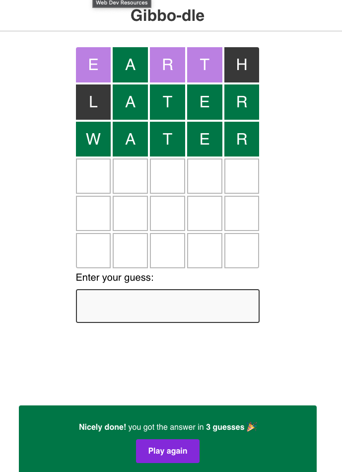

# Gibbo-dle: Word game

## Description
A working wordle clone built with React and Parcel (one of my projects as part of the [Joy of React](https://github.com/joy-of-react) course)

## How to play
1. Clone this project
2. Run `npm i` to install dependencies
3. To play, run `npm run dev` and go to [http://localhost:1234](http://localhost:1234)

